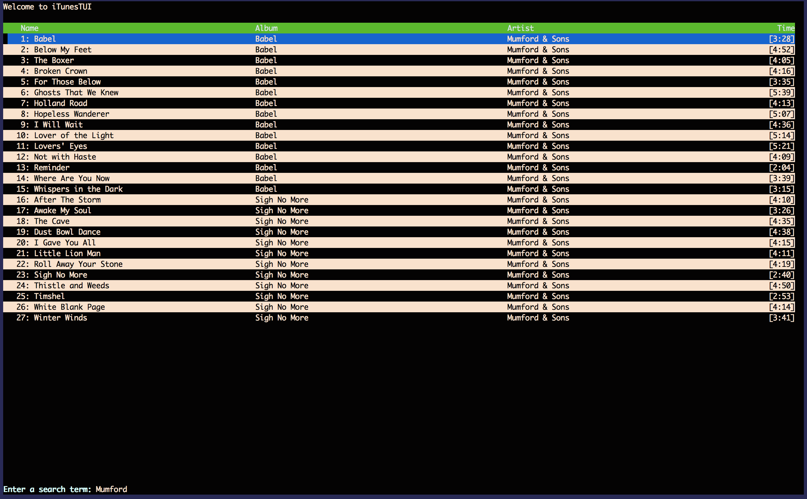

# iTunes TUI

Control iTunes from the terminal via a
[TUI](https://en.wikipedia.org/wiki/Text-based_user_interface). Unfortunately,
iTunesTUI only works on OS X due to its heavy reliance on AppleScript to hook
into iTunes.

Tested on OS X 10.10, but probably works back a couple of releases.
Written with Python 3.3, but probably works for Python 3.x. Definitely doesn't
work for Python 2.

Tested in iTerm2, OS X Terminal, and xterm, though you may have to change your
color scheme to be able to read everything.

Tested in iTerm2, OS X Terminal, and xterm, though you may have to change your
color scheme to be able to read everything.

## DISCLAIMER

This project is in no way affiliated with Apple or iTunes. The appearance of any
song titles/artists in screenshots is not intended as endorsement. These songs
are the sole property of the artists/record labels. I'm sorry if I'm infringing
on anything.

## Note
**iTunes must be running for iTunesTUI to work**

## Features

* [*] Nice(ish) interface to view your library
* [*] Search your library for songs, albums, playlists, etc.
* [*] Play songs

## Screenshot

<<<<<<< HEAD

## Installation

Clone from github!
<<<<<<< HEAD
`git clone https://github.com/adanoff/iTunesTUI`

## Running

First run `pip install -r requirements.txt` in the top directory.
Then run `python -m tui.tui` and you should be up and running!

## Usage

iTunesTUI uses a vim-esque system for navigation and control.

### Navigation

`j` - move down (down arrow also works)  
`k` - move up (up arrow also works)

### Commands

Use `:` to enter "command mode" then use:

`q` - quit  
`s` - search  
`p` - load a playlist  

**NOTE** None of these commands take arguments. After typing the command and
pressing enter, you will be prompted to enter more information if necessary.

## Contributing

If you find a bug (of which there are probably many) _please_ create an issue.
If you actually want to work on something, the iTunes interface probably needs
the most work, but feel free to work on anything on the **TODO** list.

## TODO

* Iron out bugs in iTunes API
* Add ability to add songs to "up next", in order to mimic iTunes behavior after
  searching for and playing a song
* Fix "visual" bugs/improve curses usage
* Better navigation
* Better code design (more OOP and better separation of view and model)
* Better documentation

## Known Bugs

There are several visual bugs (highlighting, etc) that arise when navigating
songs, probably because of issues with how I use curses. This can cause more
serious issues when the song table has to be repopulated (e.g. when a search
occurs). Navigating and searching seem not to mix well in general, and may
sometimes caues the program to crash.

## License

MIT License. See LICENSE.txt.
